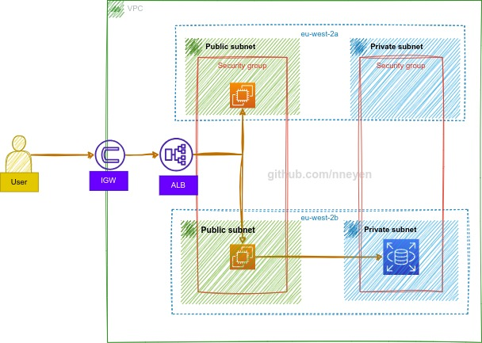

# OVERVIEW

In this project, we will set up a simple 2-tier architecture using Terraform.
The aim of this project is to teach you how to show how to implement infrastructure as code. 
Since this is a monolith architecture, it is not highly available. 
This Architecture will include the following:
- A VPC with public and private subnets
- An Internet gateway
- Security Groups
- RDS
- EC2 Instances 
- Application Load Balancer

This is my second time writing terraform, I tried a few things. 
- I loaded my user data from a file in the "scripts folder". I found that this made my code neater
- I utilized count to keep my resource blocks few - I must say this was both exciting and challenging. 

The next time I attempt this, I will try to use terraform modules

## Architecture
Here's a rough sketch of the Architecture


## Code Snippets

**Install Apache Scrip**
This is the user data script that is installed on the EC2 instance at launch
```
    #! /bin/bash
    sudo apt-get update
    sudo apt-get install -y apache2
    sudo systemctl start apache2
    sudo systemctl enable apache2
    echo "<h1> Hello! I was deployed via Terraform </h1>" | sudo tee /var/www/html/index.html

```
